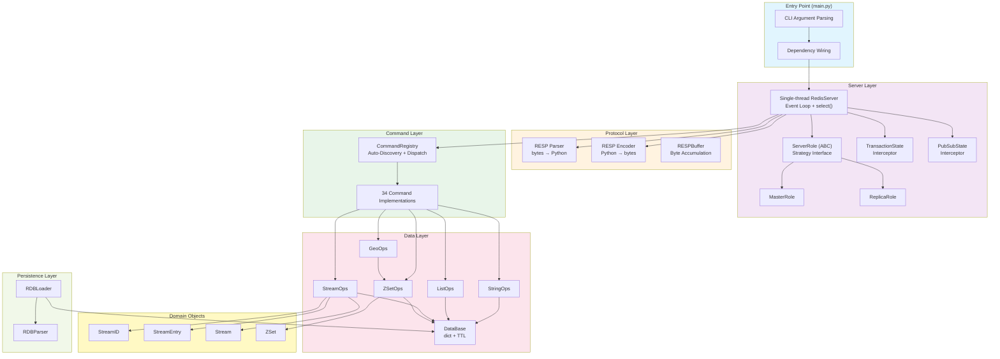

# Redis From Scratch (Python)
A fully functional Redis server implemented from scratch in Python 3.14, built as part of the [CodeCrafters](https://codecrafters.io/) Redis challenge.

Here are a couple of points I strictly tried to follow:
- I only used python's built-in libraries.
- I did my best to follow original Redis design decisions wherever was possible. For instance, the whole server is single-thread, so all the functionalities and architecutral decisions are complied with this limitation.
- 100% of the code is implemented by MYSELF not AI. I used AI to consult about design patterns, architectures, generating some diagrams, and original Redis internal logics. So AI was only involved as a consultant and visualization assistant.

## Architecture



**Key design decisions:**
- Single-threaded, non-blocking I/O via `select()` — no threads, no async/await
- **Strategy Pattern** for master/replica roles — zero conditionals in the server
- **Command Pattern** with auto-discovery + constructor-based DI
- **Interceptor Pattern** for transactions (MULTI/EXEC) and Pub/Sub
- **Callback + Closure** pattern for blocking commands (BLPOP, XREAD BLOCK)

## Features

| Category | Commands |
|---|---|
| Strings | `GET`, `SET` (EX/PX), `INCR` |
| Lists | `LPUSH`, `RPUSH`, `LPOP`, `LLEN`, `LRANGE`, `BLPOP` |
| Streams | `XADD`, `XRANGE`, `XREAD` (BLOCK) |
| Sorted Sets | `ZADD`, `ZCARD`, `ZRANGE`, `ZRANK`, `ZREM`, `ZSCORE` |
| Geo | `GEOADD`, `GEODIST`, `GEOPOS`, `GEOSEARCH` |
| Transactions | `MULTI`, `EXEC`, `DISCARD` |
| Pub/Sub | `SUBSCRIBE`, `UNSUBSCRIBE`, `PUBLISH` |
| Replication | `REPLCONF`, `PSYNC`, `WAIT` |
| ACL | `AUTH`, `ACL SETUSER/GETUSER` |
| General | `PING`, `ECHO`, `TYPE`, `KEYS`, `CONFIG`, `INFO` |
| Persistence | RDB file loading on startup |

## Running

Requires Python 3.14 and [uv](https://docs.astral.sh/uv/).

```bash
# Master on default port 6379
uv run -m app.main

# Custom port
uv run -m app.main --port 6380

# As replica
uv run -m app.main --port 6380 --replicaof "localhost 6379"

# With RDB persistence
uv run -m app.main --dir ./data --dbfilename dump.rdb
```

Connect with any Redis client:

```bash
redis-cli -p 6379
```
